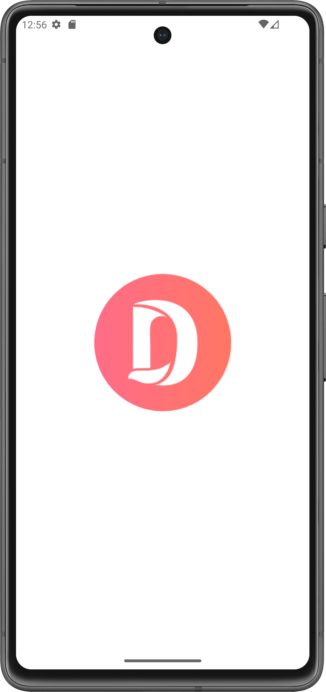
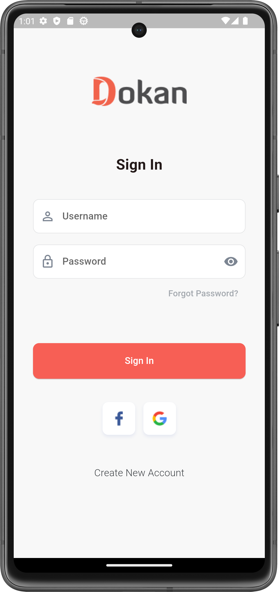
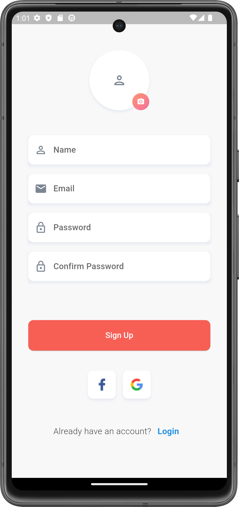
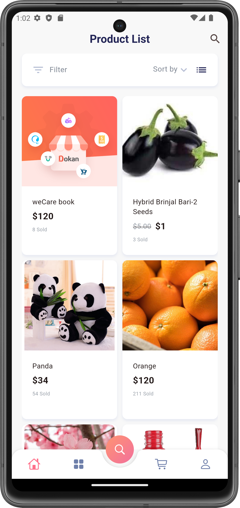
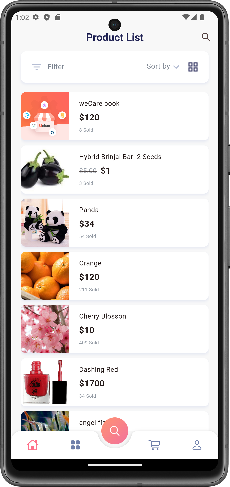
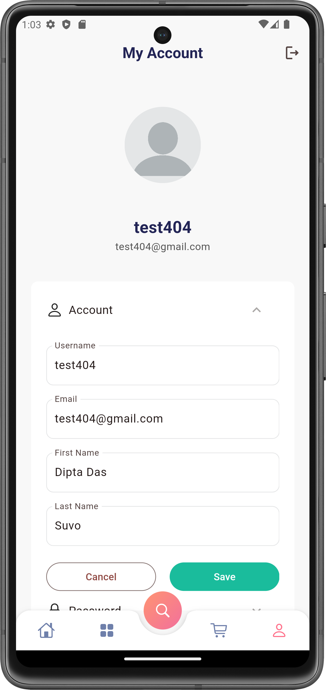

# Dokan App Demo

[](https://opensource.org/licenses/MIT)
[](https://github.com/username/repository/releases)

This Flutter app offers a straightforward user experience with basic authentication features
utilizing WordPress REST APIs. Users can create an account by providing their username, email, and
password. Once registered, they can log in using their username and password.
After logging in, users have access to a collection of local JSON products. Additionally, users can
update their first and last names in the profile sectio

## Table of Contents

- [Screenshots](#screenshots)
- [Installation](#installation)
- [Usage](#usage)
- [Features](#features)
- [Contact](#contact)

## Screenshots

Include screenshots of your app to give users a visual idea of what it looks like.








## Installation

Instructions on how to install and set up your project.

```bash
git clone https://github.com/diptadassuvo/dokan_app.git
cd repository
flutter pub get
flutter pub run build_runner build --delete-conflicting-outputs 
flutter run --dart-define-from-file=config.json
```

## Usage

Made as a practice also as a task project.

## Features

- Create account
- Login
- Load load json file
- Update profile (first name & Last name)

## Contact

[](mailto:diptadassuvo@gmail.com)
